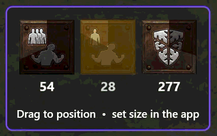
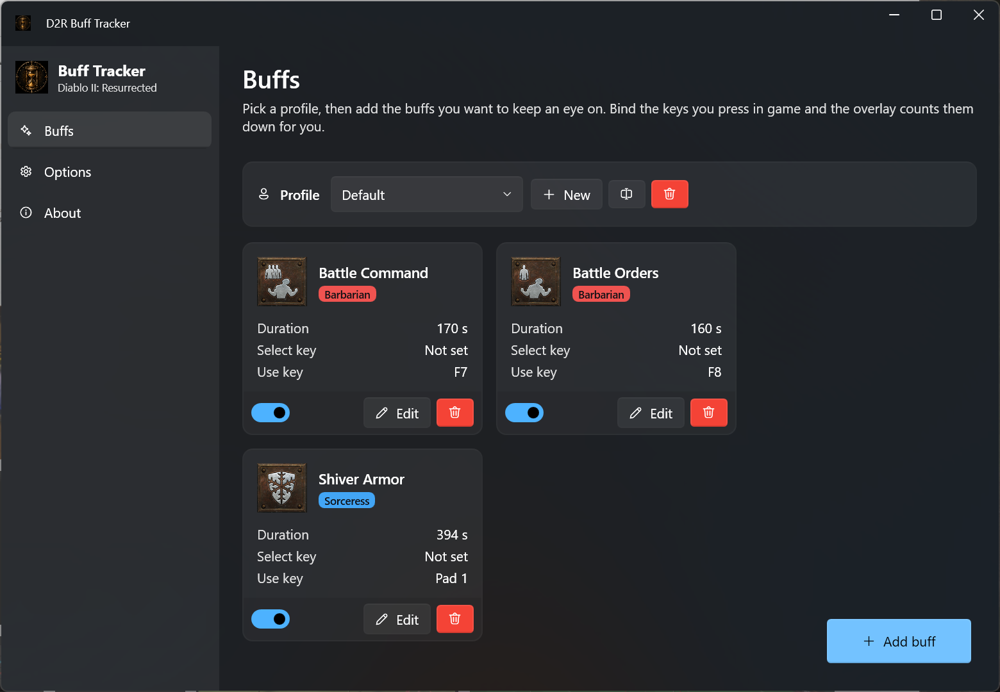
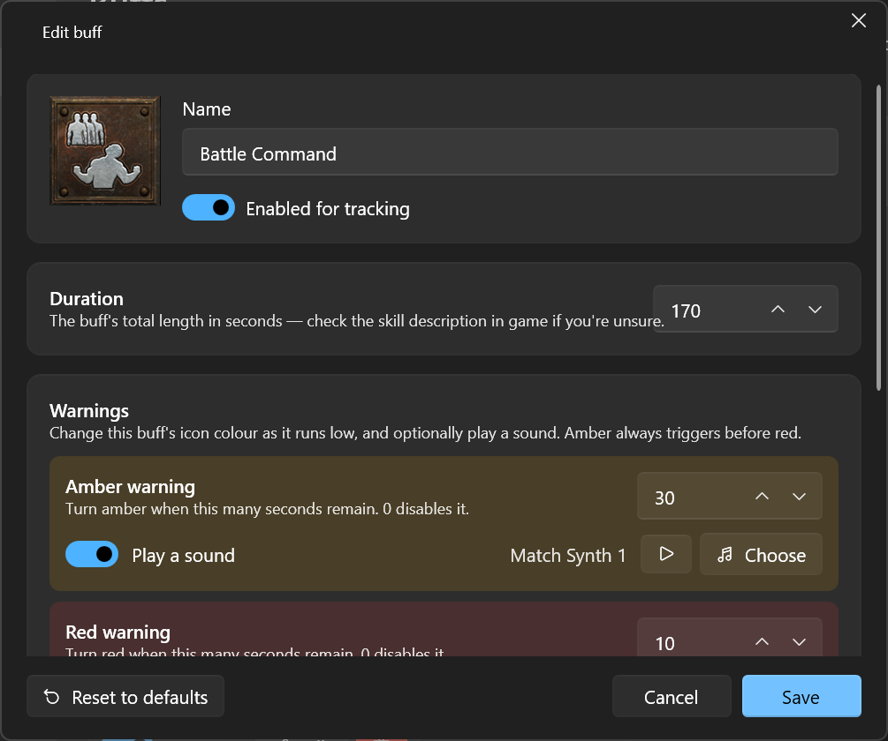
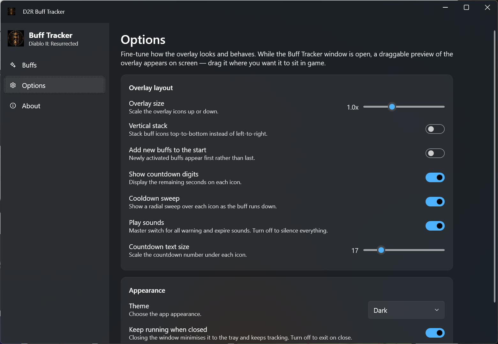

# D2R Buff Tracker

<div align="center">

**Never miss a recast - a lightweight onscreen tracker that gives visibility of your self-cast buff timers supporting every class in Diablo II: Resurrected, including Reign of the Warlock.**

[](https://github.com/draximus-prime/D2RBuffTracker/actions/workflows/ci.yml)
[](https://github.com/draximus-prime/D2RBuffTracker/actions/workflows/release.yml)
[](https://github.com/draximus-prime/D2RBuffTracker/releases/latest)
[](https://github.com/draximus-prime/D2RBuffTracker/releases)
[](LICENSE)
[](https://dotnet.microsoft.com/)
[](#)
[](https://github.com/draximus-prime/D2RBuffTracker/issues)
[](https://github.com/draximus-prime/D2RBuffTracker/commits/main)
[](https://github.com/draximus-prime/D2RBuffTracker/stargazers)

</div>

---

## Overview

D2R Buff Tracker watches your keyboard, mouse, and controller for the buttons you
bind to your buffs, then shows a clean countdown overlay on top of the game so you
always know when it's time to recast. It starts and stops automatically as the game
gains and loses focus, stays out of the way (fully click-through), and never touches
the game's memory or files.

> [!NOTE]
> This is an unofficial, fan-made utility. It is not affiliated with or endorsed by
> Blizzard Entertainment. It reads only the input devices you configure - it does
> not read, write, or inject into the game process.

### Download a release

**[⬇ Download the latest release](https://github.com/draximus-prime/D2RBuffTracker/releases/latest/download/D2RBuffTracker-win-x64.zip)** - just unzip and run `D2RBuffTracker.exe`. No install, no .NET required.

## Screenshots

### In-game overlay



### Buffs page



### Buff editor



### Options



## Features

- **Live buff countdowns** - a compact, always-on-top overlay with per-buff icons,
  a radial cooldown sweep, and optional digits.
- **Global input tracking** - low-level keyboard &amp; mouse hooks plus controller
  support (XInput for Xbox-style pads, DirectInput fallback for others), all working
  while the game is the foreground window.
- **Select + use key sequences** - supports the "pick the skill, then cast it"
  binding style so buffs only start when actually cast.
- **Automatic start/stop** - tracking follows the game: it activates when Diablo II:
  Resurrected is focused and pauses when it isn't.
- **Amber / red warnings** - per-buff colour thresholds as a buff nears expiry, with
  optional per-buff warning and expiry **sounds** from a built-in sound gallery.
- **Profiles** - separate buff sets per character or build, switchable in a click.
- **Drag-to-position preview** - size and place the overlay exactly where you want it.
- **System tray** - minimises to the tray and keeps tracking in the background.
- **Private by design** - no network access, no telemetry; settings are stored
  locally as JSON.

## Requirements

- **Windows 10 / 11 (x64)**
- **Self-contained** release builds need nothing else - the .NET runtime is bundled.
- **Framework-dependent** release builds require the
  [.NET 10 Desktop Runtime](https://dotnet.microsoft.com/download/dotnet/10.0).
- To build from source you need the **[.NET 10 SDK](https://dotnet.microsoft.com/download)**.

## Installation

Every release ships **four** build variants on the
[**Releases**](https://github.com/draximus-prime/D2RBuffTracker/releases/latest) page.
Pick the one that suits you, extract it anywhere, and run `D2RBuffTracker.exe`.

| Download | .NET 10 required? | Alert sounds | Size | Best for |
| -------- | ----------------- | ------------ | ---- | -------- |
| [`D2RBuffTracker-win-x64.zip`](https://github.com/draximus-prime/D2RBuffTracker/releases/latest/download/D2RBuffTracker-win-x64.zip) | No (self-contained) | ✅ Included | ~140 MB | **Most people** - just download and run |
| [`D2RBuffTracker-win-x64-nosound.zip`](https://github.com/draximus-prime/D2RBuffTracker/releases/latest/download/D2RBuffTracker-win-x64-nosound.zip) | No (self-contained) | ❌ None | ~90 MB | Zero-install, but you don't want the bundled sounds |
| [`D2RBuffTracker-win-x64-framework-dependent.zip`](https://github.com/draximus-prime/D2RBuffTracker/releases/latest/download/D2RBuffTracker-win-x64-framework-dependent.zip) | **Yes** | ✅ Included | ~90 MB | You already have the [.NET 10 Desktop Runtime](https://dotnet.microsoft.com/download/dotnet/10.0) |
| [`D2RBuffTracker-win-x64-framework-dependent-nosound.zip`](https://github.com/draximus-prime/D2RBuffTracker/releases/latest/download/D2RBuffTracker-win-x64-framework-dependent-nosound.zip) | **Yes** | ❌ None | ~11 MB | Smallest download; you have .NET 10 and don't want sounds |

> [!NOTE]
> **Self-contained** builds bundle the entire .NET 10 runtime, so they run on a clean
> Windows install with nothing else to set up (this is why they're larger).
> **Framework-dependent** builds are much smaller but require the
> [.NET 10 Desktop Runtime](https://dotnet.microsoft.com/download/dotnet/10.0) to be
> installed. The **nosound** variants simply omit the bundled alert sounds - the app runs
> identically, threshold/expiry sounds just stay silent (you can still add your own custom
> sound files later). If you're not sure, choose the first one.

### Build from source

```powershell
git clone https://github.com/draximus-prime/D2RBuffTracker.git
cd D2RBuffTracker
dotnet build -c Release
dotnet run -c Release
```

To produce a portable, self-contained single-file build:

```powershell
dotnet publish -c Release -r win-x64 --self-contained true -p:PublishSingleFile=true
```

## Usage

1. Launch the app and create (or pick) a **profile**.
2. Add buffs - choose from the class catalog or create custom ones.
3. In the buff editor, **bind** each buff's use key (and optional select key) by clicking
   *Bind* and pressing the key, mouse button, or controller button you use in game.
4. Set the **duration** and, if you like, amber/red warning thresholds and sounds.
5. Use the **Options** page to position and scale the overlay via the draggable preview.
6. Alt-tab into the game - tracking starts automatically. Cast a buff and watch the
   countdown appear.

## Tech stack

| Area            | Technology                                            |
| --------------- | ----------------------------------------------------- |
| UI framework    | WPF (.NET 10, `net10.0-windows`)                      |
| UI theme        | [WPF-UI](https://github.com/lepoco/wpfui) (Fluent)    |
| Tray icon       | Hardcodet.NotifyIcon.Wpf                               |
| Controller I/O  | Vortice.XInput + Vortice.DirectInput                  |
| Serialization   | Newtonsoft.Json                                       |
| Pattern         | MVVM                                                   |

## Project structure

```
D2RBuffTracker/
├─ Assets/        # Bundled buff icons and alert sounds
├─ Models/        # Domain + persisted settings (AppSettings, TrackedBuff, ...)
├─ Mvvm/          # Small MVVM helpers (ObservableObject, ...)
├─ Overlay/       # The click-through countdown overlay window + VMs
├─ Services/      # Input hooks, gamepad poller, tracking engine, foreground watcher
├─ ViewModels/    # Main application view models
└─ Views/         # Windows, pages, and controls
```

## Contributing

Issues and pull requests are welcome. Please keep changes focused, match the existing
code style, and make sure `dotnet build -c Release` passes with no warnings before
opening a PR.

## License

This project is licensed under the **GNU General Public License v3.0** - see the
[LICENSE](LICENSE) file for details.

Diablo II: Resurrected is a trademark of Blizzard Entertainment, Inc. This project is
not affiliated with, endorsed by, or sponsored by Blizzard Entertainment.
